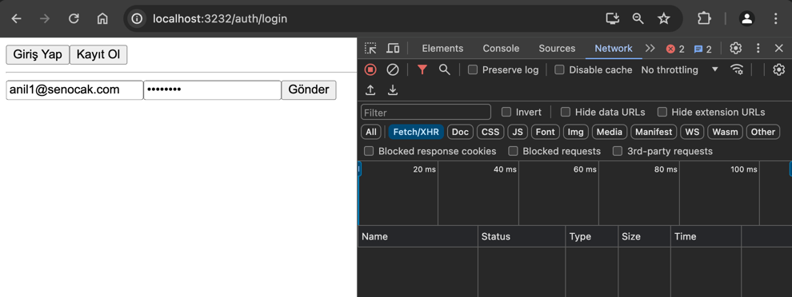
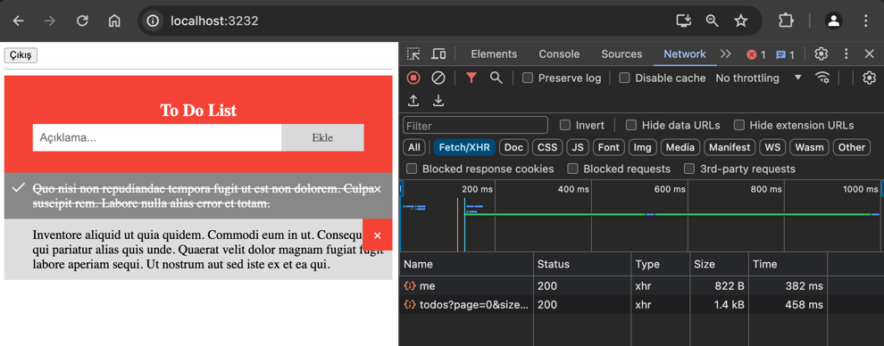

# TO-DO app 

```sh
git clone https://github.com/senocak/Spring-Kotlin-Couchbase.git
```

## Technology Stack
- Backend
  - Jvm, 17.0.10
  - Kotlin, 1.9.23
  - Gradle, 8.7
  - SpringBoot, 3.3.1
    - Spring Data Couchbase
  - Couchbase, 7.6.1
  - Swagger
  - Jupiter (JUnit 5)
  - Mockito
- Frontend
  - Node, 20
  - Typescript, 4.9.5
  - React, 18.2.0
  - Redux, 8.1.3
- Ops
  - Mac OS, 14.4.1
  - Docker, 26.1.3

### Running Backend Side
```sh 
cd backend
./gradlew clean build -Pprofile=unit #runs only unit tests and build the package
./gradlew clean build -Pprofile=integration #runs only integration tests and build the package
./gradlew bootRun # runs the SpringBoot application via commandline
```
### Running Frontend Side

```sh
cd frontend
yarn install
yarn start
```

Visit: `http://localhost:3232/`

### Running using docker
```sh 
docker-compose up -d
```

### Screenshoots


